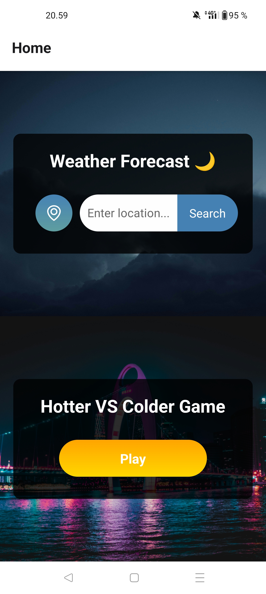
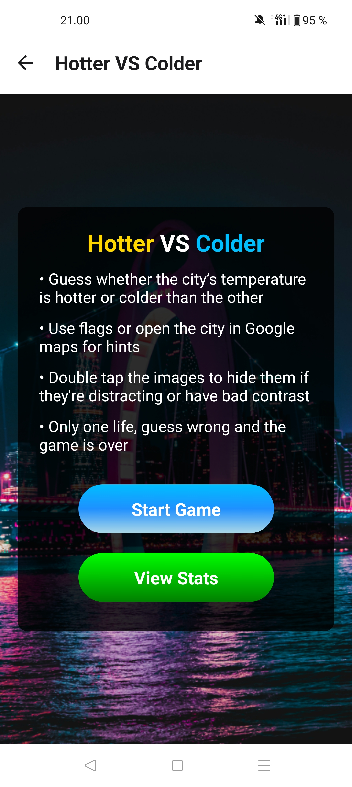
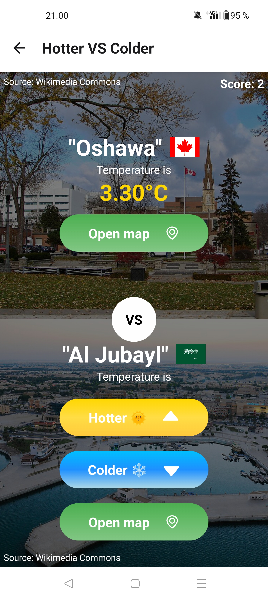
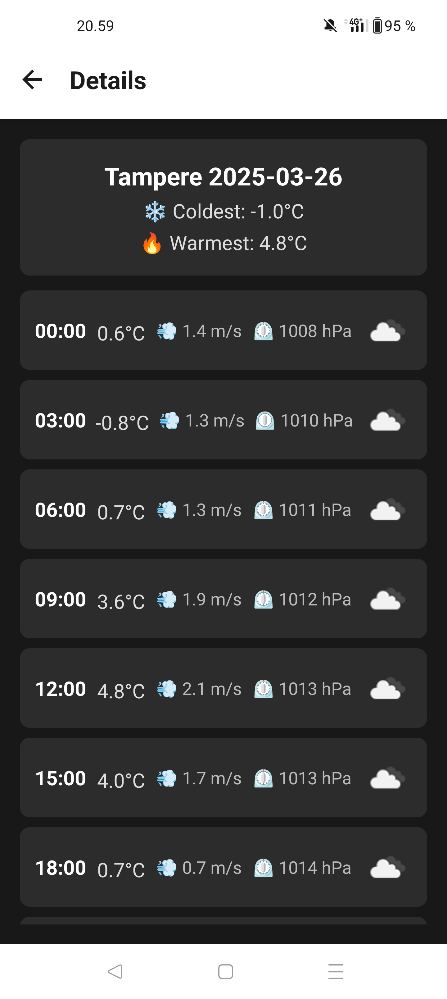

# 🌦️ Weather App with a Guessing Game

A mobile app built with React Native that combines a simple weather lookup with a fun and fast-paced guessing game.

## 🎮 Concept

Check the current weather for your location or any city around the world. Or, when you quickly get bored of that, jump into a game where you’re shown one city's temperature and asked:

> “Is the next city's temperature hotter or colder?”

Built on top of real-time weather data, this game turns weather info into a fun, interactive challenge inspired by the [Higher Lower Game](https://www.higherlowergame.com/).

## 💡 Why This App?

This app goes beyond your typical “boring” weather app by layering in a temperature guessing game. It transforms a basic utility into something more engaging and highly replayable thanks to dynamic, real-world data. It may not compete with major weather apps in terms of sheer features, but it offers something you have definitely not seen in a weather app before.

## 🔧 Features

- 🌍 View weather by your current location or search
- 🎯 Guess temperatures between random global cities
- 📈 Game stats tracking using device local storage
- ⚙️ Built with React Native + Expo
- 📡 Uses several third-party APIs and device geolocation

## 🧪 Tech Stack

- React Native
- Expo
- OpenWeatherMap API
- Geolocation API
- Wikipedia API (for city images)

## 📸 Screenshots

<div align="center">
  
  
  
  
</div>

## 🚀 How to Run

To run this app locally using Expo:

1. **Clone the repository**

    ```bash
    git clone https://github.com/yourusername/weather-guess-game.git
    cd weather-guess-game
    ```

2. **Install dependencies**

    ```bash
    npm install
    ```

3. **Add environment variables**

    ```bash
    # You can choose to either use the API key directly or alternatively provide custom URLs
    # that call the OpenWeatherMap API endpoints. The latter should always be used in production.

    EXPO_PUBLIC_OPEN_WEATHER_MAP_API_KEY="your open weather map key"
    EXPO_PUBLIC_TEMPERATURE_API_URL="custom url (optional)"
    EXPO_PUBLIC_FORECAST_API_URL="custom url (optional)"
    ```

4. **Start development server**

    ```bash
    # You may have to add --tunnel flag depending on your device and internet setup
    npx expo start
    ```

## ⚡Try It Online (Expo Snack)
You can also try out a simplified version of the app directly in your browser via Expo Snack.  
👉 [Open in Snack](https://snack.expo.dev/@simoa/weatherapp)  
Disclaimer: Some features in the snack version may not work as well and the snack versions codebase may not be up to date with this repository.
